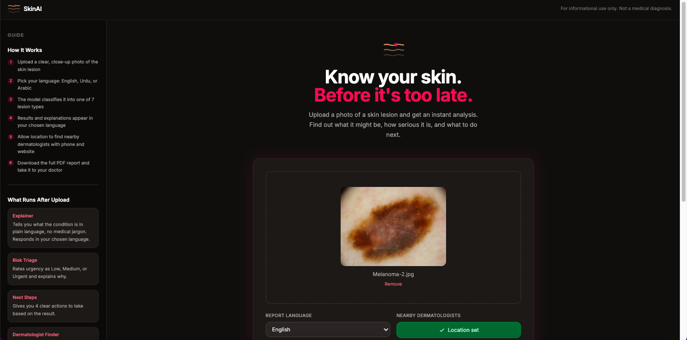
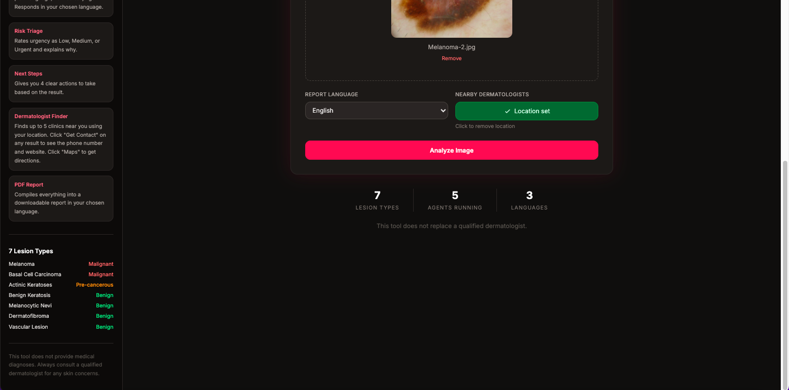
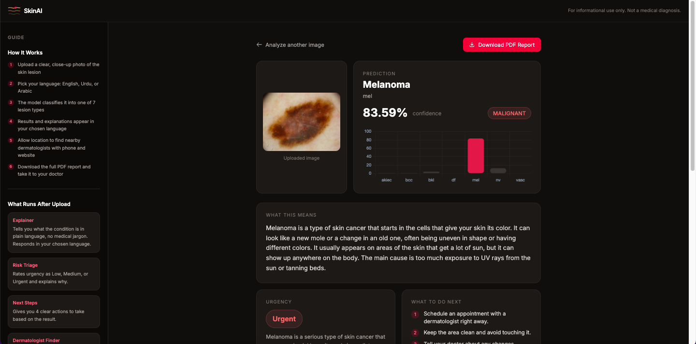
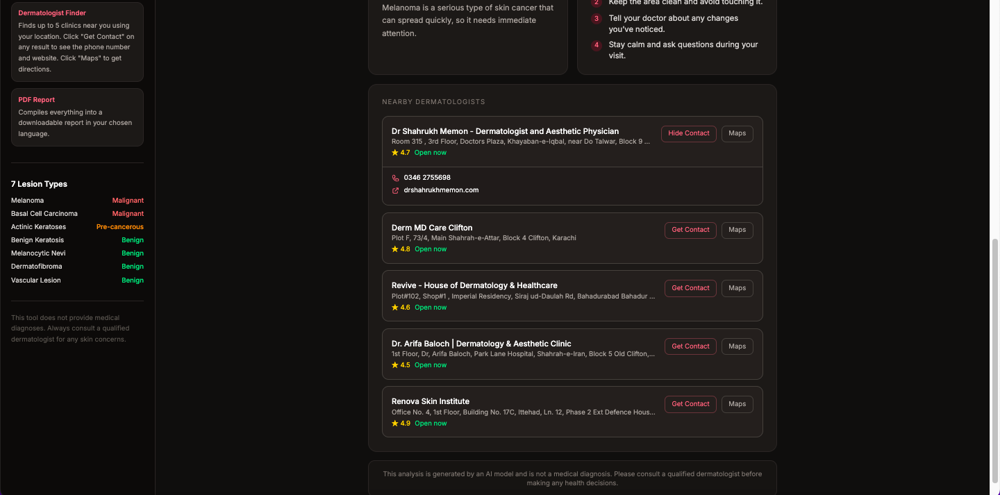

# 🩺 SkinAI — Skin Lesion Analyzer

A skin lesion analysis tool built with a fine-tuned EfficientNetB0 model and a multi-agent AI pipeline. Explains results in plain language, assesses urgency, suggests next steps, finds nearby dermatologists with contacts and directions, and generates a downloadable PDF report in English, Urdu, or Arabic.

[](https://www.python.org/)
[](https://fastapi.tiangolo.com/)
[](https://www.tensorflow.org/)
[](https://openai.com/)

---

## 🎯 Overview

SkinAI lets you upload a photo of a skin lesion and get an instant, structured analysis. The deep learning model classifies the lesion into one of 7 types, then a multi-agent pipeline takes over, explaining what the condition is, rating how urgent it is, and telling you exactly what to do next. It also finds nearby dermatologists using your location and compiles everything into a clean PDF report.

### 7 Lesion Types

| Condition | Risk |
|-----------|------|
| Melanoma | Malignant |
| Basal Cell Carcinoma | Malignant |
| Actinic Keratoses | Pre-cancerous |
| Benign Keratosis | Benign |
| Melanocytic Nevi | Benign |
| Dermatofibroma | Benign |
| Vascular Lesion | Benign |

---

## ✨ Features

- 🔬 **Deep Learning Classification** — Fine-tuned EfficientNetB0 trained on HAM10000 with oversampling and class weights to handle severe class imbalance
- 🤖 **Multi-Agent AI Pipeline** — Three independent GPT-4o-mini agents run after classification: Explainer, Risk Triage, and Next Steps
- 🗺️ **Dermatologist Finder** — Finds up to 5 nearby clinics using Google Places API, with phone numbers, websites, and directions
- 🌐 **Multilingual** — Full support for English, Urdu, and Arabic across the result page and PDF report
- 📄 **PDF Report** — Downloadable report with proper RTL rendering for Urdu and Arabic
- ⚡ **Fast** — Model preloaded on startup, agents and dermatologist search run concurrently

---

## 🤖 Agent Pipeline

Each agent runs independently and in parallel after the model makes its prediction:

| Agent | What it does |
|-------|-------------|
| **Explainer** | Describes the condition in plain language — what it is, what it looks like, what causes it |
| **Risk Triage** | Rates urgency as Low, Medium, or Urgent with a one-sentence reason |
| **Next Steps** | Gives 4 clear, practical actions based on the result and urgency |

---

## 🖼️ Screenshots

<div align="center">
  
  
</div>

<div align="center">
  
  
</div>

---

## 📊 Model Details

| Detail | Value |
|--------|-------|
| **Architecture** | EfficientNetB0 (transfer learning) |
| **Dataset** | HAM10000 |
| **Classes** | 7 |
| **Training** | Two-stage — frozen base then fine-tuned top layers |
| **Class Imbalance** | Oversampling to 1000 samples/class + class weights |
| **Input Size** | 224 x 224 |
| **Training Platform** | Google Colab (GPU) |

---

## 🚀 Getting Started

### Prerequisites

- Python 3.10+
- OpenAI API key
- Google Places API key
- Arial Unicode font at `/Library/Fonts/Arial Unicode.ttf` (for PDF RTL support on macOS)

### Setup

1. **Clone the repository**
```bash
git clone https://github.com/adeel-iqbal/skin-lesion-analyzer.git
cd skin-lesion-analyzer
```

2. **Create a virtual environment**
```bash
python -m venv venv
source venv/bin/activate  # Windows: venv\Scripts\activate
```

3. **Install dependencies**
```bash
pip install -r requirements.txt
```

4. **Set up environment variables**
```bash
cp .env.example .env
```
Fill in your keys in `.env`:
```
OPENAI_API_KEY=your_openai_key
GOOGLE_PLACES_API_KEY=your_google_places_key
```

5. **Add model weights**

Place the trained model files in the `models/` directory:
```
models/
├── skin_model.keras
└── classes.json
```

Train your own using the notebook in `notebooks/skin_lesion_classifier.ipynb`, or use the provided weights.

6. **Run the app**
```bash
uvicorn app.main:app --host 127.0.0.1 --port 8080
```

Open [http://127.0.0.1:8080](http://127.0.0.1:8080) in your browser.

---

## 💻 Usage

1. Upload a clear, close-up photo of the skin lesion
2. Select your language (English, Urdu, or Arabic)
3. Optionally allow location access to find nearby dermatologists
4. Click **Analyze Image**
5. Review the classification, explanation, urgency rating, and next steps
6. Click **Get Contact** on any dermatologist to see phone and website
7. Download the PDF report to take to your doctor

---

## 📁 Project Structure

```
skin-lesion-analyzer/
│
├── app/
│   ├── main.py               # FastAPI app, routes, startup
│   ├── model.py              # Model loading and inference
│   ├── agent.py              # Multi-agent GPT pipeline
│   ├── derm_finder.py        # Google Places dermatologist search
│   ├── pdf_report.py         # Multilingual PDF generation
│   ├── templates/
│   │   ├── base.html         # Base layout with sidebar
│   │   ├── index.html        # Upload page
│   │   └── result.html       # Results page
│   └── static/
│       ├── favicon.svg
│       └── js/upload.js      # Upload, preview, location logic
│
├── models/
│   ├── skin_model.keras      # Trained EfficientNetB0 weights
│   └── classes.json          # Class index mapping
│
├── notebooks/
│   └── skin_lesion_classifier.ipynb  # Training notebook (Google Colab)
│
├── assets/                   # Screenshots
├── reports/                  # Generated PDF reports
├── uploads/                  # Uploaded images
├── requirements.txt
├── .env.example
└── README.md
```

---

## 🛠️ Technologies Used

### Machine Learning
- **TensorFlow / Keras** — Model training and inference
- **EfficientNetB0** — Transfer learning backbone
- **HAM10000** — Skin lesion dataset

### AI Agents
- **OpenAI GPT-4o-mini** — Explainer, Triage, and Next Steps agents

### Backend
- **FastAPI** — Web framework
- **Uvicorn** — ASGI server
- **httpx** — Async HTTP for Google Places API

### Frontend
- **Jinja2** — HTML templating
- **Tailwind CSS** — Styling
- **Chart.js** — Confidence bar chart

### PDF Generation
- **ReportLab** — PDF creation
- **arabic-reshaper + python-bidi** — RTL text rendering for Urdu and Arabic

### APIs
- **Google Places Nearby Search** — Find dermatologists by location
- **Google Place Details** — Fetch phone numbers and websites

---

## ⚠️ Disclaimer

This tool is for informational and educational purposes only. It does not provide medical diagnoses. Always consult a qualified dermatologist for any skin concerns.

---

## 📧 Contact

**Adeel Iqbal**

- 📧 Email: [adeelmemon096@yahoo.com](mailto:ai@rankmeglobal.com)
- 💼 LinkedIn: [linkedin.com/in/adeeliqbalmemon](https://linkedin.com/in/adeeliqbalmemon)
- 🐙 GitHub: [@adeel-iqbal](https://github.com/adeel-iqbal)

---

<div align="center">
  <p>Made with ❤️ by Adeel Iqbal</p>
  <p>⭐ Star this repo if you find it useful!</p>
</div>
